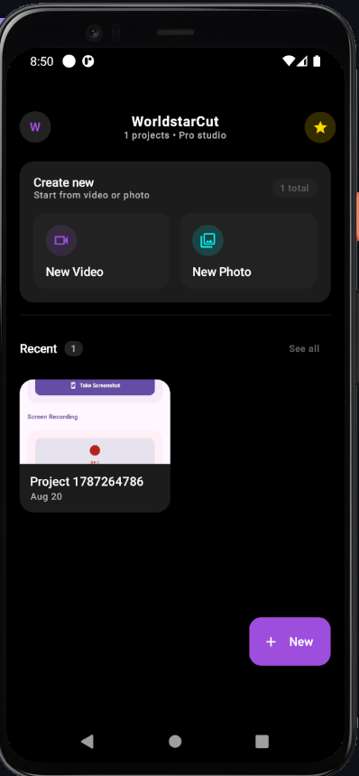
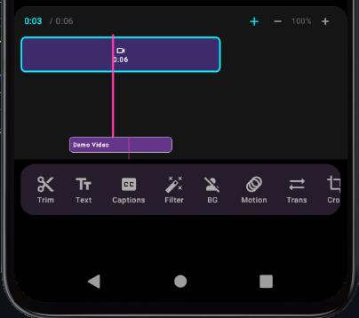
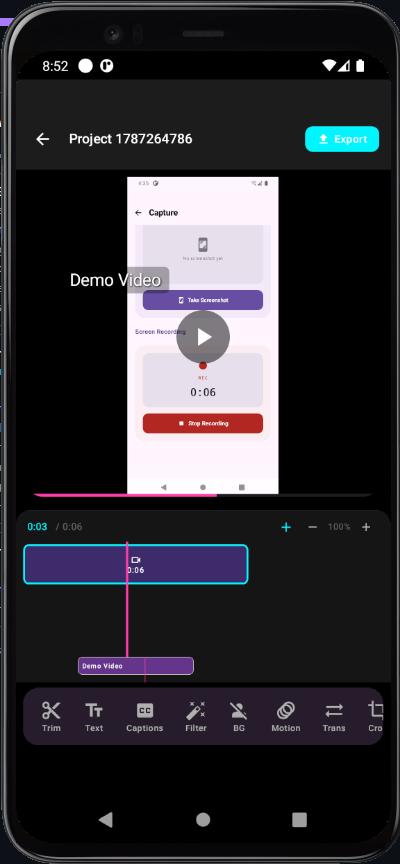

# WorldstarCut — Professional Mobile Video & Photo Editor

> **CapCut / InShot-level editor for Android + FastAPI marketplace backend.** Edit video and photo with a SaaS-grade timeline, overlays, effects, motion, and AI — then export and sell packs.

<p align="center">
  
  
  
  
</p>

---

## ✨ Demo

| Home — SaaS | Editor — 5-lane Timeline | Preview — Overlays |
|---|---|---|
|  |  |  |

> Placeholders — run the app to generate real screenshots. Homescreen shows first-frame thumbnails via `MediaMetadataRetriever`.

---

## 🚀 Features

### Editor (Android)
- **Multi-clip timeline** — Video + image clips, trim (`trimStartMs`/`trimEndMs`), 5 lanes (Video, Text, Sticker, Audio, Motion) with zoom, playhead, drag to move `startMs`
- **Text overlays** — Multi per clip, drag/pinch/rotate, 10 colors, 5 fonts, **10 CapCut animations** (fade/slide/scale/glitch/wave/typewriter) with **entrance + exit** (`animation`/`animationOut`, 600ms), `startMs`/`durationMs` with slider + textfield + timeline bars
- **Sticker overlays** — Pick from gallery (copied to `files/stickers/` for persistence), drag/resize/rotate, same animations + timing, 180dp tight border, delete when selected
- **Effects & Crop** — 6 filters (Vintage/Noir/Vivid/Cool/Warm/B&W) via `ColorMatrix`/`ColorFilter`, crop `cropX/Y/W/H` (0..1), 7 transitions (cross-fade)
- **Motion** — Single `motionEffect` (12 types) + **multi MotionSegments** (`startMs/durationMs`) with `Zoom In/Out`, `Pan 4-dir`, `Rotate`, `Shake`, `Ken Burns`, `Tilt 3D`, `Parallax` via `graphicsLayer` progress; draggable on timeline
- **Audio** — Music picker (`audio/*`), base volume + **ducking keyframes** (`volumeKeyframes` JSON, lerp in `startPositionPolling` via `interpolateVolume`)
- **Timeline** — `Timeline` `Column` with `HorizontalScroll`, clip chips, text/sticker bars, audio dots + faux waveform, motion bars, playhead; height 180dp
- **Preview** — `ExoPlayer` playlist + `PlayerView`, `DraggableText`/`DraggableImage` with `detectTransformGestures`, tap to select / tap empty to deselect, `progress` + `playbackMs` driven animations
- **Captions — AI** — `EditorTool.Captions` → `onGenerateCaptions()` splits `trimmedDurationMs` into 2.5s chunks, creates `TextOverlay` at `0.85y` with `fade` in/out (placeholder for Whisper/STT)
- **Background Remove — AI** — `segmentation-selfie 16.0.0-beta6`, `Clip.backgroundEffect` (`none/blur/color/image`) + `backgroundEffectValue`, preview via `Modifier.blur` / color `Box`, tool with color picker
- **Export** — `ExportRepositoryImpl` via **Media3 Transformer** (`Composition`/`EditedMediaItemSequence`, `ClippingConfiguration`, `Crop`, `OverlayEffect` + `BitmapOverlay` for stickers + `createTextBitmap` for text), image copy fallback, `Movies/WorldstarCut/export_*.mp4` + history
- **Homescreen — SaaS** — `CenterAlignedTopAppBar`, gradient `SaasCreateCard` (New Video/Photo), `ProjectCard` with first-frame thumbnails (`MediaMetadataRetriever` → `files/thumbs/thumb_{id}.jpg` cached, `coil` `AsyncImage` + `crossfade`), duration badge, exported dot, `Surface` empty state

### Backend (FastAPI) — `backend/`
- `POST /api/v1/auth/*` (register/login/Google/JWT), `GET /me`, Stripe Connect onboarding
- `Packs` CRUD + `pack_items` upload to S3 (`boto3`), `marketplace_listings` (pending/approved), search via `tsvector`
- `POST /purchase` → Stripe Checkout + webhook → `purchases` + `entitlements`, `GET /entitlements/me` + presigned download
- `PLAN.md` has full DB schema, storage, moderation (Vision), and 6-step build order

---

## 🏗️ Tech Stack

**Android:** Kotlin 2.0.21, Compose BOM 2024.12.01, Material3, Navigation 2.8.5, Hilt 2.52, Room 2.6.1 (v12, 11 migrations), Coroutines 1.9.0, Media3 1.5.0 (exoplayer, transformer, effect), Coil 2.7.0 + coil-video, Accompanist Permissions, DataStore, Gson, Timber, Lottie, FFmpegKit 8.1.7 (legacy, now Transformer), ML Kit segmentation-selfie, SplashScreen

**Backend:** FastAPI 0.115, Pydantic 2, SQLAlchemy 2 async + Alembic, Postgres 16, Redis, Celery, S3/MinIO, Stripe, `python-jose`/`passlib`, `httpx`, `pytest`

---

## 📐 Architecture

```
Clean Architecture + MVVM
app/src/main/java/com/worldstar/cut/
  core/
    data/local/db/AppDatabase (v12) — Project/Track/Clip/ExportHistory
    di/DatabaseModule, ui/theme
  features/
    video_editor/
      domain/model/Clip, TextOverlay, ImageOverlay, AudioVolumeKeyframe, MotionSegment, Track, Project
      domain/usecase/*, tracking/MotionTracker
      data/local/db/ClipDao, TrackDao + repository/TrackClipRepositoryImpl (mappers)
      presentation/viewmodel/VideoEditorViewModel (player, polling, overlay CRUD, keyframes)
      presentation/ui/screen/VideoEditorScreen (Preview, Draggable*, Timeline, ToolPanel, EditorToolsBar)
    export/
      domain/model/ExportSettings/State, data/service/ExportService, data/repository/ExportRepositoryImpl (Transformer)
      presentation/ui/screen/ExportScreen, viewmodel/ExportViewModel
    video_editor/presentation/ui/screen/HomeScreen + viewmodel/HomeViewModel (thumbnails)
backend/
  app/main.py, core/config.py, api/v1/health.py, db/session.py, models/, schemas/, services/
```

`Clip` JSON fields: `textOverlays`, `imageOverlays`, `volumeKeyframes`, `motionSegments`, `backgroundEffect` — Room `TEXT`, parsed via `org.json.JSONArray` (`parse*`/`serialize*` in `VideoEditorScreen.kt:2490`).

---

## 📂 Project Structure

```
wsc/
  app/                 # Android
    src/main/java/com/worldstar/cut/features/...
    schemas/           # Room schemas
  backend/             # FastAPI
    app/main.py
    app/core/config.py
    app/api/v1/health.py
    PLAN.md            # full backend plan
    requirements.txt
    Dockerfile
  gradle/libs.versions.toml
  README.md            # this file
```

---

## 🛠️ Getting Started

### Android
1. **Prereqs:** Android Studio Ladybug+, JDK 17, SDK 35, `minSdk 26`
2. Clone: `git clone https://github.com/god-s-only/worldstar-cut.git && cd wsc`
3. Open in Studio → Sync (if `transforms` cache corrupts: `.\gradlew.bat --stop` then `rd /s /q "%USERPROFILE%\.gradle\caches\9.0.0\transforms"` and re-sync; ensure Defender exclusion for `%USERPROFILE%\.gradle`)
4. Run: select `app` + device/emulator → Run. First launch generates `ic_launcher` AVD splash.

### Backend
```bash
cd backend
python -m venv .venv && source .venv/bin/activate  # Windows: .venv\Scripts\activate
pip install -r requirements.txt
cp .env.example .env  # set DATABASE_URL, REDIS_URL, S3_*, STRIPE_*
uvicorn app.main:app --reload --port 8000
# Docs: http://localhost:8000/docs  Health: http://localhost:8000/api/v1/health
```

---

## 📱 Screenshots

Add real device captures to `docs/screenshots/`:
- `home.png` — homescreen with thumbnails
- `timeline.png` — 5-lane timeline with text/sticker/audio/motion
- `preview.png` — drag, handles, animations
- `export.png` — ExportScreen progress

---

## 🗺️ Roadmap

- [x] Multi-clip, trim, effects, crop, transitions, speed/volume
- [x] Text/Sticker overlays + CapCut animations (in/out) + timing (slider+textfield+timeline drag) + delete + sticker lane
- [x] Motion (single + multi segments, draggable) + Audio ducking (keyframes + waveform + lerp)
- [x] Background Remove (ML Kit, blur/color/image, preview)
- [x] Captions (AI placeholder, timed)
- [x] Homescreen first-frame thumbnails + SaaS polish
- [x] Export via Transformer (trim/crop/concat + BitmapOverlay for stickers/text)
- [ ] Export overlays positioning via `OverlaySettings` + motion/background bake
- [ ] Marketplace UI in app (browse/purchase/download packs)
- [ ] Beat sync, background remove mask export, waveform from PCM

---

## 🤝 Contributing

PRs welcome — follow per-file commits: `git add <file>; git commit -m "feat: ..."; git push origin main`. Run `./gradlew assembleDebug` before push.

---

## 📄 License

 Proprietary — WorldstarCut. All rights reserved. Contact for licensing.

## 🙏 Acknowledgments

- Media3, Coil, ML Kit, FastAPI, Stripe, Supabase docs
- InShot / CapCut for UX inspiration
